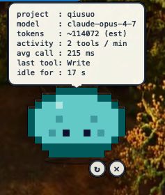
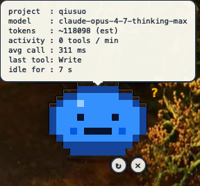
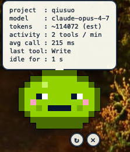
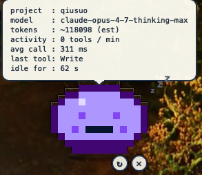

# Cursor Slime

[](LICENSE)
[]()
[]()

A pixel-art slime desktop pet that reacts to your Cursor IDE / agent activity in real time. Frameless, transparent, always on top, no Dock icon.

<table align="center">
  <tr>
    <td align="center">
      <br>
      <sub><b>idle</b> · cyan</sub>
    </td>
    <td align="center">
      <br>
      <sub><b>thinking</b> · blue · <code>?</code></sub>
    </td>
  </tr>
  <tr>
    <td align="center">
      <br>
      <sub><b>working</b> · green</sub>
    </td>
    <td align="center">
      <br>
      <sub><b>sleeping</b> · purple · <code>zZz</code></sub>
    </td>
  </tr>
</table>

<p align="center"><em>Slime changes color &amp; expression by agent state. State transitions are driven by Cursor hook events in real time.</em></p>

## What it does

- Reads Cursor agent **hook events** from `~/.cursor/hooks.json`
- Aggregates per-conversation stats (project, model, tools/min, live token estimate, idle time)
- Renders an animated 8-bit slime that **changes color & expression** by state:
  - idle (cyan) — slow breathing + occasional blink
  - thinking (blue) — `?` bubble, mouth flat
  - working (lime) — wide eyes, mouth open, blush, fast bounce
  - sleeping (purple) — `zZz` after 60s of no events
- Bubble above the slime shows live metrics; tail follows the slime's head as you drag it around
- Bottom-right of the slime has tiny `↻` (restart) and `✕` (quit) buttons

## Requirements

- macOS (tested on Sonoma / Sequoia, should work 10.15+)
- Python **3.11+** with `venv` support
  - `brew install python@3.13` recommended (has Tk 9.0 if you ever fall back to tkinter)
- `jq` (used by the hook script) — `brew install jq`
- Cursor IDE with hook support enabled

## Install

```bash
git clone https://github.com/SeaAndy/cursor-slime.git
cd cursor-slime
./install.sh
```

The installer is **idempotent**:

- Existing `~/.cursor/hooks.json` is preserved; we **merge** our hook entries
- Existing venv is reused if it already has PyQt6
- Re-running `install.sh` is a safe upgrade path

## Launch

| How | What you do |
|-----|-------------|
| **Spotlight** | `Cmd + Space` → type `Cursor Slime` → Enter |
| **Finder** | open `~/Applications/CursorSlime.app` (double-click) |
| **Dock** | drag `~/Applications/CursorSlime.app` to Dock; click anytime |
| **Terminal** | `~/.cursor/pet/slimectl start` |
| **Launchpad** | search `Cursor Slime` |

## Interact

| Gesture | Effect |
|---------|--------|
| Drag the slime body | move pet around |
| Double-click | toggle the stats bubble |
| Click `↻` | restart the pet |
| Click `✕` | quit |

The pet is **single-instance** — opening the `.app` while it's running just flashes a notification.

## Files installed

```text
~/.cursor/pet/
├── slime.py                   # main app
├── make_icon.py               # icon generator
├── slimectl                   # terminal control script
├── venv/                      # ~250 MB; PyQt6 + pyobjc
├── CursorSlime.app/           # macOS app bundle
└── pet-stats.jsonl            # created on first hook event

~/.cursor/hooks/log-stats.sh   # hook script
~/.cursor/hooks.json           # merged hook config
~/Applications/CursorSlime.app # symlink to the real bundle
```

## Uninstall

```bash
./uninstall.sh
```

Cleanly removes everything. Preserves the rest of your `hooks.json`.

## Customising

Edit `~/.cursor/pet/slime.py`. Useful knobs near the top of the file:

| What | Where | Notes |
|------|-------|-------|
| Pixel size | `PIXEL = int(os.environ.get("SLIME_PIXEL", "10"))` | Bigger = chunkier slime |
| State palettes | `STATE_PALETTES` | Change colors per mood |
| Sprite shape | `BASE`, `EYES_*`, `MOUTH_*` | 14×10 grid, edit characters |
| Window size | `WIDGET_W`, `WIDGET_H` | If bubble overflows |
| Position on launch | end of `__init__` | Currently bottom-right |

After editing, `~/.cursor/pet/slimectl restart` to apply.

If you changed the sprite and want the `.app` icon to match:

```bash
~/.cursor/pet/venv/bin/python3 ~/.cursor/pet/make_icon.py
```

## Caveats

- **Token estimate is approximate.** Cursor's hook payload doesn't carry real `usage` fields, so we estimate by `(tool_input_chars + tool_output_chars) / 4`. For exact accounting use [cursor.com/dashboard](https://cursor.com/dashboard).
- **No real-time cache info or cost.** Same reason as above — Cursor doesn't expose these via hooks.
- **Cross-project scope.** User-level hooks fire for every Cursor project. The pet reflects whichever conversation last triggered an event. If you want one slime per project, move `~/.cursor/hooks.json` into the project's own `.cursor/hooks.json`.
- **No code signing.** Gatekeeper may show "unidentified developer" the first time you open the `.app` — right-click → Open to bypass.
- **macOS only.** Linux/Windows ports would require porting the bash installer and the `.app` bundle; the PyQt6 pet itself is mostly cross-platform. PRs welcome.

## Project layout

```text
cursor-slime/
├── README.md
├── LICENSE
├── install.sh                  # macOS installer
├── uninstall.sh                # cleanly removes everything
├── slime.py                    # the PyQt6 desktop pet
├── make_icon.py                # generates .icns from sprite
├── slimectl                    # start/stop/restart/status/logs
├── hooks/
│   └── log-stats.sh            # Cursor hook → ~/.cursor/pet-stats.jsonl
├── app/
│   └── Contents/               # .app bundle skeleton (icon filled at install time)
│       ├── Info.plist
│       ├── MacOS/CursorSlime
│       └── Resources/
└── docs/
    └── screenshots/            # demo images for the README
```

## Contributing

PRs and issues welcome. Some good first targets:

- Linux port (replace `.app` bundle with a `.desktop` file)
- Windows port (replace bash with PowerShell, `.app` with `.lnk` + `pythonw.exe`)
- Real token data once Cursor exposes `usage` in hook payloads
- Additional slime sprites / animations
- Per-project mode (read `.cursor/hooks.json` instead of `~/.cursor/hooks.json`)

Before opening a PR, please:

1. Run `./uninstall.sh && ./install.sh` to verify your change still installs cleanly
2. Keep `slime.py` self-contained — no new third-party deps without discussion
3. Update this README if you change the install layout or hooks

## License

[MIT](LICENSE) © 2026 [SeaAndy](https://github.com/SeaAndy)
